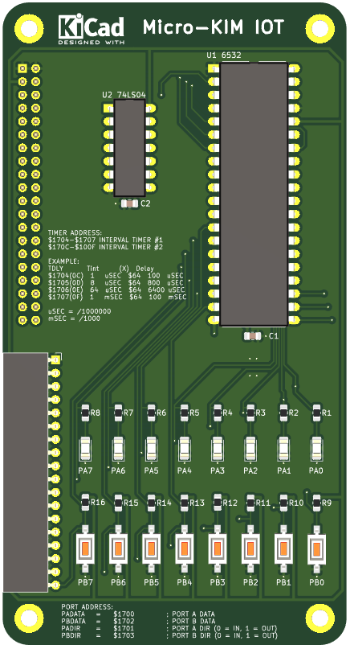

### Micro-KIM-IOT REV0.1

### BOM
|Обозначение|Значение|Кол-во|
|C1, C2|.1u 0805|2|
|J1|PinHeader_2x20_P2.54mm_Vertical|1|
|J2|PinSocket_1x18_P2.54mm_Horizontal|1|
|R1-R8|220 0805|8|
|R9-R16|4.7K 0805|8|
|U1|6532|1|
|U2|74LS04|1|
|PA0-PA7|LED 1206|8|
|PB0-PB7|SW_SPST_3X6|8|